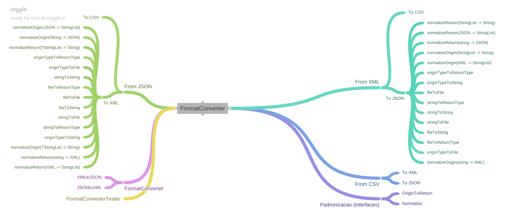
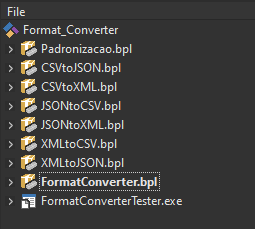

# Format Converter (Delphi)

>Conversor de formatos (JSON, XML, etc) para Delphi


 


<br />

*******
## Índice
 1. [Uso](#uso)
 2. [Estrutura](#estrutura)
 3. [Workgroup](#workgroup)
 4. [Dependências](#dependencias)
 5. [Instalação/Configuração](#instalacao)
 6. [Contribuir](#contribuir)
 7. [Créditos](#creditos)
 8. [Licença](#licenca)
 9. [Documentação](#documentacao)
 10. [TODO](#todo)
 11. [Árvore do Projeto](#arvore)
*******

<br />

## Uso <a name="uso"></a>
Implementar as **[formas de uso](documentation/usage)**.


<br />

+ **PACKAGE**
  - **CLASS**
    * **METHOD:** Descrição do Método
      + **Parametrização**
        - *var01*: Variável 01;
        - *var02*: Variável 02;
    


<br />

## Estrutura <a name="estrutura"></a>
+ **app:** Contém a compilação do(s) pacote(s) e testador(es);
+ **documentation:** Contém a documentação do(s) pacote(s);
+ **images:** Contém as imagens usadas no(s) pacote(s);
+ **modules:** Módulos não essenciais, como testadores, etc;
  - **testador tal:** Implementar;
+ **output:** Contém os arquivos précompilados usados pelo Delphi (.dcu);
+ **project:** Diretório com os projetos de cada pacote e testador;
+ **src:** Contém o fonte essencial para o funcionamento do(s) pacote(s);
  - **pacote tal:** Pacote centralizador do sistema, quando o executável faz a chamada da função solicitada é essa parte da aplicação que localiza as rotinas nos pacotes;
+ **vendor:** Contém os pacotes de terceiros;
 
<br />

## Workgroup <a name="workgroup"></a>
Deve-se manter a ordem de compilação do projeto exatamente como na imagem.



<br />

## Dependências <a name="dependencias"></a>
+ **Dependência01:** Dependência;

<br />

## Instalação/Configuração <a name="instalacao"></a>
+ **[Configuração](documentation/configuracaoFonte.md)**

<br />

## Contribuir <a name="contribuir"></a>
1. Faça um "fork" com base no master;
2. Faça "commit" de suas alterações (Caso estiver resolvento alguma "issue" não esqueça de na mensagem escrever "Fixed #numeroIssue");
3. Faça "push" de seus commits;
4. Solicite um "pull request" para o master do repositório principal.

<br />

## Créditos <a name="creditos"></a>
[@bomrafinha](https://github.com/bomrafinha)

<br />

## [Licença](./LICENSE) <a name="licenca"></a>
Verificar tipo de licença.
+ Propriedade Intelectual: [@bomrafinha](https://github.com/bomrafinha)

<br />

## Documentação <a name="documentacao"></a>
+ **[Implementar documentação](documentation/documentacao.md)**

<br />

## TODO <a name="todo"></a>
+ Documentação
  - README
  - LICENCE
  - usage
  - sitemap
  - workgroup
  - configuração do fonte
  - arquivo padronização de código e documentação
  - forma de versionamento
  - shields
  - especificar linguagem padrão

+ Estrutura básica do código
  - Criação da forma que ficarão os pacotes
  - Pacotes com recursos visuais (arrastar e soltar)
  - Criação dos testadores
  - Configurações de path e versionamento

+ Conversor JSON -> XML
  - Entrada JSON    -> Saída XML
  - Entrada JSON    -> Saída string
  - Entrada JSON    -> Saída arquivo
  - Entrada string  -> Saída XML
  - Entrada string  -> Saída string
  - Entrada string  -> Saída arquivo
  - Entrada arquivo -> Saída XML
  - Entrada arquivo -> Saída string
  - Entrada arquivo -> Saída arquivo

+ Conversor JSON -> CSV
  - Entrada JSON    -> Saída CSV
  - Entrada JSON    -> Saída string
  - Entrada JSON    -> Saída arquivo
  - Entrada string  -> Saída CSV
  - Entrada string  -> Saída string
  - Entrada string  -> Saída arquivo
  - Entrada arquivo -> Saída CSV
  - Entrada arquivo -> Saída string
  - Entrada arquivo -> Saída arquivo

+ Conversor XML -> JSON
  - Entrada XML     -> Saída JSON
  - Entrada XML     -> Saída string
  - Entrada XML     -> Saída arquivo
  - Entrada string  -> Saída JSON
  - Entrada string  -> Saída string
  - Entrada string  -> Saída arquivo
  - Entrada arquivo -> Saída JSON
  - Entrada arquivo -> Saída string
  - Entrada arquivo -> Saída arquivo

+ Conversor XML -> CSV
  - Entrada XML    -> Saída CSV
  - Entrada XML    -> Saída string
  - Entrada XML    -> Saída arquivo
  - Entrada string  -> Saída CSV
  - Entrada string  -> Saída string
  - Entrada string  -> Saída arquivo
  - Entrada arquivo -> Saída CSV
  - Entrada arquivo -> Saída string
  - Entrada arquivo -> Saída arquivo

+ Conversor CSV -> JSON
  - Entrada CSV     -> Saída JSON
  - Entrada CSV     -> Saída string
  - Entrada CSV     -> Saída arquivo
  - Entrada string  -> Saída JSON
  - Entrada string  -> Saída string
  - Entrada string  -> Saída arquivo
  - Entrada arquivo -> Saída JSON
  - Entrada arquivo -> Saída string
  - Entrada arquivo -> Saída arquivo

+ Conversor CSV -> XML
  - Entrada CSV    -> Saída XML
  - Entrada CSV    -> Saída string
  - Entrada CSV    -> Saída arquivo
  - Entrada string  -> Saída XML
  - Entrada string  -> Saída string
  - Entrada string  -> Saída arquivo
  - Entrada arquivo -> Saída XML
  - Entrada arquivo -> Saída string
  - Entrada arquivo -> Saída arquivo

<br />

## Árvore do Projeto <a name="arvore"></a>
```
FormatConversor
├── app
│   └── .gitkeep
├── documentation
│   ├── images
│   │   ├── sitemap - Copia (2).png
│   │   ├── sitemap.png
│   │   └── workgroup.png
│   ├── usage
│   │   └── uso.png
│   ├── configuracaoFonte.md
│   └── documentacao.md
├── images
│   └── .gitkeep
├── modules
│   ├── U_Testador.View.fmx
│   └── U_Testador.View.pas
├── output
│   └── .gitkeep
├── project
│   ├── Delphi XMLtoJSON.groupproj
│   ├── Testador.dpr
│   ├── Testador.dproj
│   ├── XMLtoJSON.dpk
│   └── XMLtoJSON.dproj
├── src
│   └── XMLtoJSON
│       └── U_XMLtoJSON.pas
├── vendor
│   └── .gitkeep
├── .gitattributes
├── .gitignore
├── LICENSE
└── README.md
```