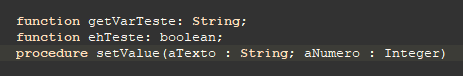

# Format Converter (Delphi)

>Conversor de formatos (JSON, XML, etc) para Delphi.

<br />


 


<br />

*******
## Índice
 1. [Uso](#uso)
 2. [Sitemap](#sitemap)
 3. [Estrutura](#estrutura)
 4. [Workgroup](#workgroup)
 5. [Dependências](#dependencias)
 6. [Instalação/Configuração](#instalacao)
 7. [Contribuir](#contribuir)
 8. [Checklist para Contribuir](#checklist)
 9. [Créditos](#creditos)
 10. [Licença](#licenca)
 11. [Padronização de Código](#source)
 12. [TODO](#todo)
 13. [Árvore do Projeto](#arvore)
*******

<br />

## Uso <a name="uso"></a>

- **TXMLtoJSON**
  * **stringToString:** Converte um XML em forma de String em um JSON em forma de string (string);
    + **Parametrização**
      - *strContent:* XML à converter (string);
  * **stringToFile:** Converte um XML em forma de String em um arquivo JSON (boolean);
    + **Parametrização**
      - *strContent:* XML à converter (string);
      - *filePathResult:* Caminho do arquivo JSON à ser salvo (string);
  * **stringToReturnType:** Converte um XML em forma de String em um JSON em forma de TJSONObject (TJSONObject);
    + **Parametrização**
      - *strContent:* XML à converter (string);
  * **fileToString:** Converte um arquivo XML em um JSON em forma de string (string);    
    + **Parametrização**
      - *filePath:* Caminho do arquivo XML à converter (string);
  * **fileToFile:** Converte um arquivo XML em um arquivo JSON (boolean);
    + **Parametrização**
      - *filePath:* Caminho do arquivo XML à converter (string);
      - *filePathResult:* Caminho do arquivo JSON à ser salvo (string);
  * **fileToReturnType:** Converte um arquivo XML em um JSON em forma de TJSONObject (TJSONObject);
    + **Parametrização**
      - *filePath:* Caminho do arquivo XML à converter (string);
  * **originTypeToString:** Converte um XML em forma de TXMLDocument em um JSON em forma de string (string);
    + **Parametrização**
      - *content:* XML à converter (TXMLDocument);
  * **originTypeToFile:** Converte um XML em forma de TXMLDocument em um arquivo JSON (boolean);
    + **Parametrização**
      - *content:* XML à converter (TXMLDocument);
      - *filePathResult:* Caminho do arquivo JSON à ser salvo (string);
  * **originTypeToReturnType:** Converte um XML em forma de TXMLDocument em um JSON em forma de TJSONObject (TJSONObject);
    + **Parametrização**
      - *content:* XML à converter (TXMLDocument);
  * **normalizeOrigin:** Converte um XML em forma de String em um XML em forma de TXMLDocument (TXMLDocument);
    + **Parametrização**
      - *content:* XML à normalizar (string);
  * **normalizeOrigin:** Converte um XML em forma de TXMLDocument em um XML em forma de TStringList (TStringList);
    + **Parametrização**
      - *content:* XML à normalizar (TXMLDocument);
  * **normalizeOrigin:** Converte um XML em forma de TStringList em um XML em forma de String (string);
    + **Parametrização**
      - *content:* XML à normalizar (TStringList);
  * **normalizeReturn:** Converte um JSON em forma de String em um JSON em forma de TJSONObject (TJSONObject);
    + **Parametrização**
      - *content:* JSON à normalizar (string);
  * **normalizeReturn:** Converte um JSON em forma de TJSONObject em um JSON em forma de TStringList (TStringList);
    + **Parametrização**
      - *content:* JSON à normalizar (TJSONObject);
  * **normalizeReturn:** Converte um JSON em forma de TStringList em um JSON em forma de String (string);
    + **Parametrização**
      - *content:* JSON à normalizar (TStringList);

<br />
 
## [Sitemap](https://coggle.it/diagram/XmZ2-WVe0wuFMqlu/t/-) <a name="sitemap"></a>   


<br />

## Estrutura <a name="estrutura"></a>
+ **app:** Contém a compilação do(s) pacote(s) e testador(es);
+ **documentation:** Contém a documentação do(s) pacote(s);
+ **images:** Contém as imagens usadas no(s) pacote(s);
+ **modules:** Módulos não essenciais, como testadores, etc;
  - **Format_Converter:** Testa as converções de formato (também usado para pegar o número de build);
+ **output:** Contém os arquivos pré compilados usados pelo Delphi (.dcu);
+ **project:** Diretório com os projetos de cada pacote e testador;
+ **src:** Contém o fonte essencial para o funcionamento do(s) pacote(s);
  - **OriginToReturn:** Contém a interface de que comanda a implementação dos pacotes;
  - **XMLtoJSON:** Contém o pacote usado para conversão de XML para JSON;
+ **vendor:** Contém os pacotes de terceiros;
 
<br />

## Workgroup <a name="workgroup"></a>
Deve-se manter a ordem de compilação do projeto como na imagem.


<br />

## Dependências <a name="dependencias"></a>
+ **Sem dependências até o momento.**

<br />

## Instalação/Configuração <a name="instalacao"></a>
+ **[Configuração](documentation/instalacao.md)**

<br />

## Contribuir <a name="contribuir"></a>
1. Faça um "fork" com base no master;
2. Faça "commit" de suas alterações (Caso estiver resolvento alguma "issue" não esqueça de na mensagem escrever "Fixed #numeroIssue");
3. Faça "push" de seus commits;
4. Solicite um "pull request" para o master do repositório principal.

### Criando uma *Issue*
Para criar uma *issue* atente para o seguinte:
+ Selecionar o *label* adequado para a *issue* (esse *label* poderá vir a ser alterado, mas a não designação faz com que a *issue* fique perdida).


+ Selecionar o projeto *FormatConverter - Kanban*, isso organizará o que está sendo feito e o que deverá ser feito.


<br />

## Checklist para Contribuir <a name="checklist"></a>
+ Testar as funcionalidades criadas / alteradas;
+ Marcar com "#" os issues concluídos, nos commits;
+ Readme (caso nescessário)
  - Número do build;
  - Alterar indice;
  - Alterar / adicionar forma de uso;
  - Incluir pacotes / classes / métodos / parâmetros nas formas de uso;
  - Alterar sitemap;
  - Alterar estrutura da aplicação;
  - Imagem atualizada do Workgroup;
  - Adicionar / Remover dependências (pacotes de terceiros);
  - Atualizar métodos de instalação / configuração do pacote;
  - Atualizar a documentação do fonte;
  - Remover / adicionar itens ao TODO;
  - Atualizar árvore do projeto;
+ Ao adicionar itens ao TODO, não esquecer de criar a "issue" correspondente;
  * Labels principais
    - **bug:** Correção de algum problema;
    - **documentation:** Alteração na documentação;
    - **enhacement:** Alteração de funcionalidade existente para melhorá-la;
    - **feature:** Nova funcionalidade;
  * Projeto
    - **FormatConverter - Kanban:** Para melhor organizar o projeto;

<br />

## Créditos <a name="creditos"></a>
[@bomrafinha](https://github.com/bomrafinha)

<br />

## [Licença](./LICENSE) <a name="licenca"></a>

<br />

## Padronização de Código <a name="source"></a>
### Versionamento
Para versionar o FormatConverter deve-se usar como base o versionamento para windows 32 bits do Format_Converter.exe, da forma que se segue:


#### onde:
1. Versão principal, só muda quando o funcionamento básico do sistema altera de forma considerável;
2. Quantidade de módulos funcionais do sistema;
3. Quantidade de funções públicas disponíveis no sistema;
4. Versão de build do sistema auto-gerado pelo Delphi;
5. Deve-se manter o build como auto incremento;

Para cada teste compilado com sucesso deve-se dar *build* no .exe para versionar (shift + F9).

Os *releases* do repositório serão feitos a cada vez que um módulo estiver 100% finalizado, ou quando um conserto muito relevante for realizado. 

<br />

### Padrões adotados no projeto
Para um melhor entendimento do projeto foi-se adotado alguns padrões que facilitam a identificação de cada estrutura usada. São, basicamente, o uso de *camelcase*, com variações nas iniciais;

#### Variáveis de método
Variáveis locais devem ser *camelcase* iniciando em minúsculo.

Observar o espaçamento entre a declaração de variáveis e o inicio do método.


#### Variáveis privadas
A declaração de váriaveis privadas deve ocorrer sempre dentro dos modificadores de acesso. 

Devem começar sempre com "f" minúsculo, seguido por seu nome em *camelcase* com a inicial em maiúsculo.


#### Propriedades
Propriedades devem usar *camelcase* começando sempre com a inicial em maiúsculo.

Devem ter exatamente o nome de sua variável privada e/ou metodo de acesso, eliminando apenas o prefixo (f, get, set).


#### Métodos
A declaração de métodos deve ocorrer sempre dentro dos modificadores de acesso. 

Métodos devem ser *camelcase* iniciando em minúsculo.

Os parâmetros do método devem ser *camelcase* iniciando em minúsculo.

Procurar, quando possível, usar prefixos *get*, *set*, *eh*, etc de acordo com a função do método e/ou seu retorno.



#### Interfaces
Interfaces devem começar sempre com a letra "I" (maiúsculo), seguido por seu nome em *camelcase* com a inicial em maiúsculo também.


#### Classes
Classes devem começar sempre com a letra "T" (maiúsculo), seguido por seu nome em *camelcase* com a inicial em maiúsculo também.

Classes que não extendem nenhuma outra classes em específico devem extender *TInterfacedObject*.


#### Chamada de métodos em múltiplas linhas
Métodos com chamadas muito extensas devem ser chamados usando padrão de identação JSON.


#### Uso de blocos *begin end*
Estruturas que não se utilizam do bloco de abertura e fechamento de código, como *ifs* de uma linha, em um código muito extenso geralmente atrapalham na leitura do código para posteriores modificações. Por esse motivo **todas** as estruturas devem possuir o bloco de abertura e fechamento (*begin .. end*)


#### Identação
Modificadores de acesso devem ser declarados de forma a ficarem alinhados à declaração da classe.

Declaração de métodos, propriedades, construtores/destrutores, bem como o *var* da declaração de variáveis, devem estar alinhados.

Agrupar *procedures* e *functions* sem alterná-los.

Separar declações de variáveis, métodos, construtores, destrutores e propriedades com uma linha em branco, bem como deixar uma linha em branco antes da declaração de modificador de acesso, ou fim do bloco, exceto no primeiro modificador após a declaração da classes.


#### Um código bem padronizado é muito mais fácil de ler, mesmo por programadores que utilizam outras linguagens.

<br />

## TODO <a name="todo"></a>
+ Documentação
  - configuração do fonte

+ Estrutura básica do código
  - Pacotes com recursos visuais (arrastar e soltar)

+ Conversor JSON -> XML
  - Entrada JSON    -> Saída XML
  - Entrada JSON    -> Saída string
  - Entrada JSON    -> Saída arquivo
  - Entrada string  -> Saída XML
  - Entrada string  -> Saída string
  - Entrada string  -> Saída arquivo
  - Entrada arquivo -> Saída XML
  - Entrada arquivo -> Saída string
  - Entrada arquivo -> Saída arquivo
  - Normalizar origin String      -> JSON
  - Normalizar origin JSON        -> TStringList
  - Normalizar origin TStringList -> String
  - Normalizar return String      -> XML
  - Normalizar return XML         -> TStringList
  - Normalizar return TStringList -> String

+ Conversor JSON -> CSV
  - Entrada JSON    -> Saída CSV
  - Entrada JSON    -> Saída string
  - Entrada JSON    -> Saída arquivo
  - Entrada string  -> Saída CSV
  - Entrada string  -> Saída string
  - Entrada string  -> Saída arquivo
  - Entrada arquivo -> Saída CSV
  - Entrada arquivo -> Saída string
  - Entrada arquivo -> Saída arquivo
  - Normalizar origin String      -> JSON
  - Normalizar origin JSON        -> TStringList
  - Normalizar origin TStringList -> String
  - Normalizar return String      -> CSV
  - Normalizar return CSV        -> TStringList
  - Normalizar return TStringList -> String

+ Conversor XML -> CSV
  - Entrada XML    -> Saída CSV
  - Entrada XML    -> Saída string
  - Entrada XML    -> Saída arquivo
  - Entrada string  -> Saída CSV
  - Entrada string  -> Saída string
  - Entrada string  -> Saída arquivo
  - Entrada arquivo -> Saída CSV
  - Entrada arquivo -> Saída string
  - Entrada arquivo -> Saída arquivo
  - Normalizar origin String      -> XML
  - Normalizar origin XML         -> TStringList
  - Normalizar origin TStringList -> String
  - Normalizar return String      -> CSV
  - Normalizar return CSV        -> TStringList
  - Normalizar return TStringList -> String

+ Conversor CSV -> JSON
  - Entrada CSV     -> Saída JSON
  - Entrada CSV     -> Saída string
  - Entrada CSV     -> Saída arquivo
  - Entrada string  -> Saída JSON
  - Entrada string  -> Saída string
  - Entrada string  -> Saída arquivo
  - Entrada arquivo -> Saída JSON
  - Entrada arquivo -> Saída string
  - Entrada arquivo -> Saída arquivo
  - Normalizar origin String      -> CSV
  - Normalizar origin CSV         -> TStringList
  - Normalizar origin TStringList -> String
  - Normalizar return String      -> JSON
  - Normalizar return JSON        -> TStringList
  - Normalizar return TStringList -> String

+ Conversor CSV -> XML
  - Entrada CSV    -> Saída XML
  - Entrada CSV    -> Saída string
  - Entrada CSV    -> Saída arquivo
  - Entrada string  -> Saída XML
  - Entrada string  -> Saída string
  - Entrada string  -> Saída arquivo
  - Entrada arquivo -> Saída XML
  - Entrada arquivo -> Saída string
  - Entrada arquivo -> Saída arquivo
  - Normalizar origin String      -> CSV
  - Normalizar origin CSV         -> TStringList
  - Normalizar origin TStringList -> String
  - Normalizar return String      -> XML
  - Normalizar return XML         -> TStringList
  - Normalizar return TStringList -> String

<br />

## Árvore do Projeto <a name="arvore"></a>
```
FormatConverter
├── app
│   └── .gitkeep
├── documentation
│   ├── images
│   │   ├── sitemap.png
│   │   └── workgroup.png
│   ├── documentacao.md
│   └── instalacao.md
├── images
│   └── icone
│       ├── icon 150x150.png
│       ├── icon 44x44.png
│       ├── icon.ico
│       ├── icon.png
│       └── icon.psd
├── modules
│   └── Format_Converter
│       ├── U_FormatConverter.View.fmx
│       └── U_FormatConverter.View.pas
├── output
│   └── .gitkeep
├── project
│   ├── CSVtoJSON.dpk
│   ├── CSVtoJSON.dproj
│   ├── CSVtoXML.dpk
│   ├── CSVtoXML.dproj
│   ├── Format_Converter.dpr
│   ├── Format_Converter.dproj
│   ├── FormatConverter.groupproj
│   ├── JSONtoCSV.dpk
│   ├── JSONtoCSV.dproj
│   ├── JSONtoXML.dpk
│   ├── JSONtoXML.dproj
│   ├── OriginToReturn.dpk
│   ├── OriginToReturn.dproj
│   ├── XMLtoCSV.dpk
│   ├── XMLtoCSV.dproj
│   ├── XMLtoJSON.dpk
│   └── XMLtoJSON.dproj
├── src
│   ├── CSVtoJSON
│   │   └── U_CSV.JSON.pas
│   ├── CSVtoXML
│   │   └── U_CSV.XML.pas
│   ├── JSONtoCSV
│   │   └── U_JSON.CSV.pas
│   ├── JSONtoXML
│   │   └── U_JSON.XML.pas
│   ├── OriginToReturn
│   │   └── U_Origin.Return.pas
│   ├── XMLtoCSV
│   │   └── U_XML.CSV.pas
│   └── XMLtoJSON
│       └── U_XML.JSON.pas
├── vendor
│   └── .gitkeep
├── .gitattributes
├── .gitignore
├── LICENSE
└── README.md
```
